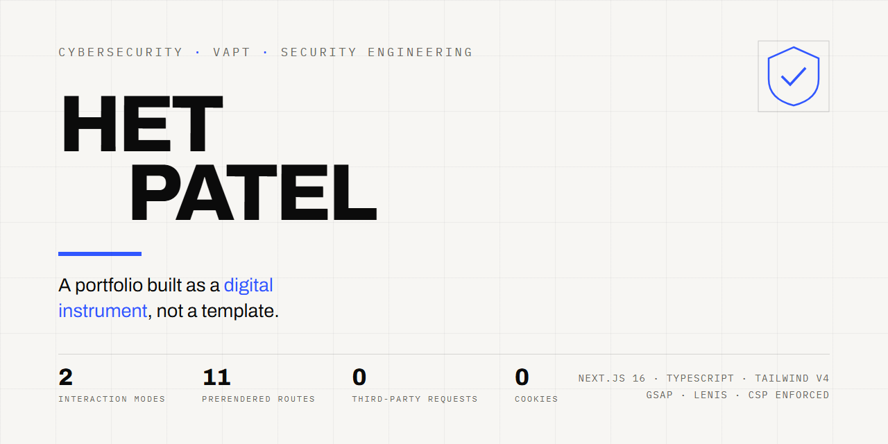
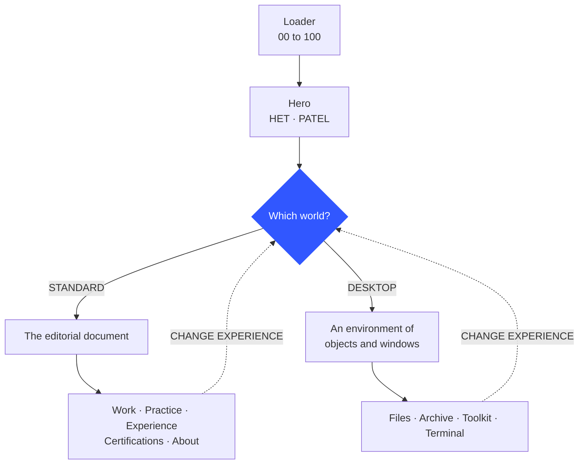
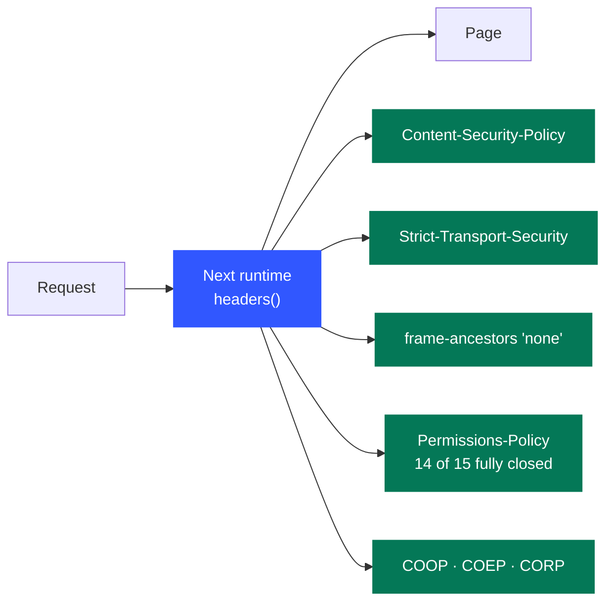
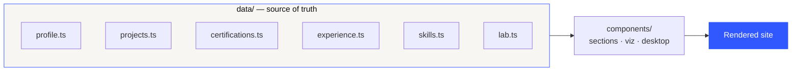

<div align="center">



### **[→ hetpatel-lemon.vercel.app](https://hetpatel-lemon.vercel.app)**

[](https://github.com/het-P301204/HETPATEL-Portfolio/actions/workflows/ci.yml)
[](https://hetpatel-lemon.vercel.app)


**[Two ways in](#-two-ways-in)** · **[The rule](#-the-rule-this-site-is-built-on)** · **[Verified in production](#-verified-in-production)** · **[Deployment](#-deployment)** · **[Design](#-design-system-and-theme)** · **[Motion](#-motion)** · **[Accessibility](#-accessibility)**

</div>

---

An editorial, single-page portfolio built as a **digital instrument** rather than a template.

```bash
npm install
npm run dev                 # http://localhost:3000
npm run build && npm start  # production
npm run typecheck           # tsc --noEmit
```

<table>
<tr>
<td width="25%" align="center"><b>2</b><br><sub>interaction modes</sub></td>
<td width="25%" align="center"><b>11</b><br><sub>prerendered routes</sub></td>
<td width="25%" align="center"><b>0</b><br><sub>third-party requests</sub></td>
<td width="25%" align="center"><b>0</b><br><sub>cookies · analytics · trackers</sub></td>
</tr>
</table>

The scroll architecture is reference-informed: a staircase headline with one accent word and a
pinned work stage with an `01 / 05` counter (after Catalin Vintila), scroll-as-narrative over a
drifting field of technical debris (after Emilian Misera), a framed panel that opens to full bleed
and an inverted surface for one section (after Sly), and expandable, typographically-led information
rather than cards (after Yash Ahire). None of their content, branding or assets is used — only the
interaction language.

---

## 🚪 Two ways in

After the loading sequence resolves into the name, the site asks one question and the answer decides
which world runs. Both are the same person and the same data; only the interaction model differs.



| | STANDARD | DESKTOP |
| --- | --- | --- |
| **Answers** | Who is Het? | What does his world look like? |
| **Form** | The editorial document | An environment of objects and windows |
| **Inside** | Work, practice, experience, certifications, about | Files, archive, toolkit and terminal |

<details>
<summary><b>How the two worlds coexist without a route change</b></summary>

<br>

`lib/mode.tsx` holds the only state that matters (`unset | standard | desktop`), persisted to
`localStorage` under `het-experience-mode` so a return visit can offer *continue* instead of asking
again. `CHANGE EXPERIENCE` — in the index overlay in standard mode, on the system bar in desktop
mode — always returns to the question.

No route change, no reload: the editorial world stays mounted and is parked
(`visibility: hidden`, `inert`) while the environment is on screen, so coming back lands exactly
where you left. The desktop is a dynamic import, so a visitor who chooses STANDARD never downloads
it.

</details>

---

## 📐 The rule this site is built on

> [!IMPORTANT]
> Everything on the page is supported by the résumé. No client, count, CVE, severity, percentage,
> award or year of experience is claimed anywhere, because none is documented.

Where something is a lab, a simulation or unfinished, the page says so in its own words —
`LAB ENVIRONMENT`, `CLOSED SIMULATION`, `IN PROGRESS`, `NOT STARTED`. Every project carries a
`limitations` field and every practice domain carries a `basis`. Please keep those fields populated
when you add work; **they are the reason the rest reads as credible.**

---

## 🔬 Verified in production

The claims above are checkable, so they were checked against the live deployment rather than
asserted. Reproduce any row yourself.

| Check | Result |
| --- | --- |
| Routes | **11/11** return `200`; an unknown path correctly returns `404` |
| Response headers | CSP · HSTS · `X-Frame-Options: DENY` · Permissions-Policy · COOP/COEP/CORP · Referrer-Policy · `nosniff` — all served |
| `/.well-known/security.txt` | Rewrite resolves; RFC 9116 fields valid |
| Canonical origin | `sitemap.xml`, `robots.txt` Host, `<link rel=canonical>` and `og:url` all agree |
| Third-party origins | **zero** asset requests leave the origin — fonts are self-hosted at build time |
| Social cards | Full Open Graph + Twitter set; `opengraph-image` serves a real PNG |
| Structured data | One valid JSON-LD `Person` block (`sameAs`, `knowsAbout`, `alumniOf`) |
| Semantics | Exactly one `<h1>`; zero `` without `alt`; `<noscript>` present |
| Transport | Brotli; `http://` → `https://` via `308` |

```bash
curl -sI https://hetpatel-lemon.vercel.app \
  | grep -iE "content-security|strict-transport|x-frame|permissions-policy"
```

<details>
<summary><b>Every route, and what it is</b></summary>

<br>

| Route | Type | Purpose |
| --- | --- | --- |
| `/` | page | The whole portfolio — both worlds, one document |
| `/security` | page | How the site itself is secured, in prose |
| `/accessibility` | page | The accessibility statement and its known exceptions |
| `/security.txt` | route | RFC 9116, generated from `data/profile.ts` |
| `/.well-known/security.txt` | rewrite | The canonical RFC 9116 location |
| `/robots.txt` | metadata | Host + sitemap pointer |
| `/sitemap.xml` | metadata | The three content pages |
| `/manifest.webmanifest` | metadata | PWA identity and theme colours |
| `/icon.svg` | metadata | Favicon, vector |
| `/opengraph-image` | metadata | Generated share card |
| `/_not-found` | page | 404, with the real status code |

</details>

---

## 🔑 Identity values

Both live in [`data/profile.ts`](data/profile.ts):

| Field | Current | Why |
| --- | --- | --- |
| `siteUrl` | resolved at build time | Not hardcoded. Reads `NEXT_PUBLIC_SITE_URL`, else `VERCEL_PROJECT_PRODUCTION_URL`, else `localhost:3000`. A wrong origin here fails silently — it publishes a sitemap and link previews pointing at a host that does not resolve — so it is derived rather than typed. |
| `githubUrl` | [`het-P301204`](https://github.com/het-P301204) | Set. The contact row, footer link, desktop window and `sameAs` structured data are live. Left empty, they stay visible but explicitly unavailable — nothing is hidden and nothing is invented. |

To move to a custom domain, set `NEXT_PUBLIC_SITE_URL` in the Vercel project and redeploy. Nothing
in the source changes.

Credential URLs follow the same rule and live in
[`data/certifications.ts`](data/certifications.ts). Fill one `credentialUrl` and that entry alone
becomes a working `VIEW CREDENTIAL ↗` link, the "N VERIFIABLE" count updates, and the archive-wide
note disappears. No component changes. Nothing is ever derived from the provider name.

---

## 🚀 Deployment

Hosted on **Vercel** — and the choice is load-bearing, not incidental:



[`next.config.mjs`](next.config.mjs) serves the whole header set through Next's `headers()` and
rewrites `/.well-known/security.txt`.

> [!WARNING]
> Static hosts that cannot set response headers — **GitHub Pages among them** — silently drop all of
> it. On a security portfolio that is a visible weakness, not a cosmetic one.

```bash
npm i -g vercel && vercel login && vercel --prod
```

Vercel auto-detects Next.js; there is no `vercel.json` to maintain.
[`.github/workflows/ci.yml`](.github/workflows/ci.yml) runs `npm ci`, typecheck and a clean-machine
build on every push and PR. It deliberately does **not** deploy — Vercel's Git integration does
that, and a second deploying workflow would duplicate and race it.

<details>
<summary><b>Not in this repository — and why</b></summary>

<br>

Verified by scanning the tree, not assumed. `docs/Resume.pdf`,
`docs/Cybersecurity-Portfolio-Project-Strategy.pdf` and `docs/SOURCE_OF_TRUTH.md` all carry a phone
number, and the résumé adds postal and location detail. The site publishes none of that by design —
see the note on location in [`data/profile.ts`](data/profile.ts) — so committing them to a public
repository would quietly undo that decision.

`awesome-design-md-main/` is third-party reference material and not this project's to redistribute.

</details>

---

## ➕ Adding content — no component changes needed

> [!NOTE]
> `data/` is the source of truth; the UI only consumes it. Everything below is a data edit.



| To add | Edit | Notes |
| --- | --- | --- |
| **A case** | `data/projects.ts` | `group` files it under `personal` or `lab`; counts derive from it. `motif` picks the generated figure (`scan`, `vector`, `identity`, `token`, `timeline`, `control`, `trace`, `compete`). `confidential: true` adds the SEALED mark and withheld-scope banner. |
| **A certification** | `data/certifications.ts` | `status: "IN PROGRESS"` hollows the sheet, tints its note and updates header counts. `credentialUrl` decides the verification line. |
| **A role** | `data/experience.ts` | A role is a header plus `tracks`; each track is one collapsible area of work. A second role is a second object. |
| **An academic year** | `data/education.ts` → `journey` | `state: "UNDATED"` renders an open marker saying the source records nothing, rather than inventing a milestone. |
| **A capability** | `data/skills.ts` | `practice` for domain lists, `stack` for the matrix. |
| **A lab write-up** | `data/lab.ts` → `entries` | The empty state disappears the moment the array has one object. |
| **A research direction** | `data/lab.ts` → `directions` | `SELECTED` = next build, `CONSIDERED` = catalogued. Neither implies work started. |

New diagram: add a case to `components/viz/ProjectMotif.tsx` and a `motif` key to the project type.

---

## 🗂 Structure

```
app/          layout, page, metadata, robots, sitemap, manifest, OG image
components/
  system/     Cursor, Nav, ProgressIndex, ThemeToggle, SmoothScroll
  primitives/ AnimatedText, MagneticElement, ScrollReveal, Rule, Section
  sections/   one file per section of the document
  viz/        ProjectMotif (generated case diagrams), TraceField (the signature)
data/         the source of truth — the UI only consumes this
lib/          hooks, stage (preloader → hero hand-off), useOverlay, helpers
styles/       hero.css, cases.css, sections.css (globals.css holds the tokens)
```

`lib/useOverlay.ts` owns the whole contract for anything covering the page — scroll lock
(reference-counted per owner), Escape, focus trap, focus return, cursor resync on close. Every
overlay uses it; none re-implements it.

---

## 🎨 Design system and theme

Tokens live in `app/globals.css`. Tailwind utilities point at runtime variables
(`--color-ink: var(--c-ink)`), so one attribute on `<html>` repaints the whole system — canvas
drawing included, since it reads the same properties through `readPalette()` in `lib/theme.tsx`.

| | Surface | Type | Accent |
| --- | --- | --- | --- |
| **Light** | `#f7f6f3` | `#0b0b0b` | cobalt `#3157ff` |
| **Dark** | `#0d0d0d` | `#f2f0ec` | amber `#ff6a1a` |

The two accents never appear together; each theme has one, plus a contrast-safe variant for its own
inverted surface. The theme follows the system until the visitor chooses, then persists, and is
applied before first paint by the script in the document head.

<details>
<summary><b>Why the inverted section works — the one genuinely subtle thing here</b></summary>

<br>

`.on-ink` inverts a section by redeclaring the `--color-*` names — **not** the `--c-*` ones. A custom
property is substituted where it is *declared*, so overriding the inner layer would never reach a
`--color-*` already resolved at `:root`. That distinction is the whole reason it works.

</details>

The accent is spent only where an interaction or a security state earns it: the initialising
percentage, the selected discipline, an unfinished certification, a refused permission in a diagram,
the flagged host in a scan. Both greys sit at the lightest value still clearing 4.5:1, because the
mono labels are 10–11px and there is no small-text exemption to lean on.

Type is **Archivo** (display and body, variable) and **IBM Plex Mono** (labels, metadata,
timestamps). `.t-colossal` through `.t-mono-sm` is the whole scale.

---

## 🎞 Motion

| Moment | What happens |
| --- | --- |
| **Loader → hero** | One component, because it is one moment. `00` steps to `100` in the exact position the name will occupy; the digits roll out as HET rolls in and PATEL arrives from the other side. Nothing is handed between elements, so there is no seam. Once per session. |
| **Hero outro** | Two screens tall, contents sticky: scrolling compresses the two words at different rates, separates the metadata and resolves into SECURITY ENGINEERING. |
| **Manifesto** | Two stanzas assembled line by line in one sticky frame, over three parallax layers of technical debris. |
| **Work** | Six screens tall, stage sticky — the scroll advances the project, not the page. The figure opens from a framed panel to full bleed; the title opens the record in place. |
| **Practice** | The same idea across six domains: outline becomes solid as the scroll reaches each. |
| **Certifications** | An archive: rows scale up at screen centre and compress as they leave. Scale only, never opacity, so nothing readable drops below the contrast floor. |
| **The trace** (About) | A hairline follows the pointer, latches the five concerns it passes, and resolves them into the name. Without a pointer it assembles from scroll position instead. |

Every reveal is transform and opacity only. Breakpoint-dependent choreography uses
`gsap.matchMedia()`, so crossing 768px builds or tears the stage down rather than leaving a stale
pin. GSAP owns transforms exclusively — a from-state declared in CSS as well composes with the tween
and doubles the offset.

> [!NOTE]
> `prefers-reduced-motion` resolves everything to its finished state, and so does `<noscript>`.

---

## ♿ Accessibility

Axe-core (WCAG 2.1 A/AA + best practice) is clean across the selector, the desktop, an open window
and the case, with two known false positives: the manifesto's background debris (pure `aria-hidden`
decoration, deliberately below reading weight, exempt under WCAG 1.4.3) and the custom cursor's
label, whose contrast axe cannot compute because it comes from `mix-blend-mode: difference` rather
than a colour pair.

<details>
<summary><b>What that means in the markup</b></summary>

<br>

Every desktop object is a real button with an accessible name ("Open certification archive — 9
entries · 1 pending"); the dock repeats the same set for anyone not using a pointer; window bodies
are focusable so they can be scrolled from the keyboard; and dragging is texture, never the way to
reach anything.

Semantic landmarks and heading order, a skip link, visible focus rings, and no content that exists
only inside a hover state: the hero index, the practice domains and the toolkit matrix all carry
their descriptions in the markup. Below 768px the pinned stages become a vertical index rather than
scaling down — identical content, different interaction.

</details>

---

## 📄 Licence

All rights reserved — see [LICENSE](LICENSE). Reading, cloning, running it locally and learning from
it are all explicitly permitted; republishing it as your own portfolio is not.
Security reports: [SECURITY.md](SECURITY.md).

---

<div align="center">
<sub>

**Het Patel** · [Live site](https://hetpatel-lemon.vercel.app) · [LinkedIn](https://www.linkedin.com/in/het-patel-913017345) · [GitHub](https://github.com/het-P301204)

<sub>No analytics. No cookies. No third-party runtime requests. Every route prerendered.</sub>

</sub>
</div>
