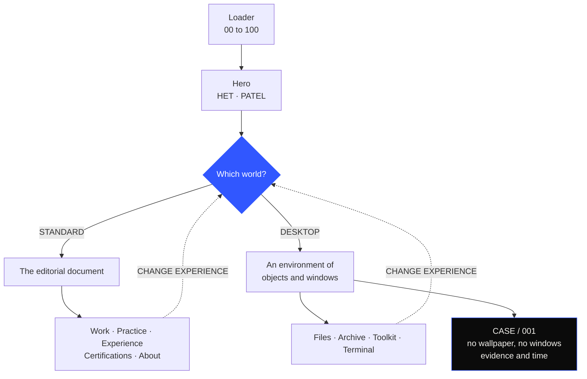
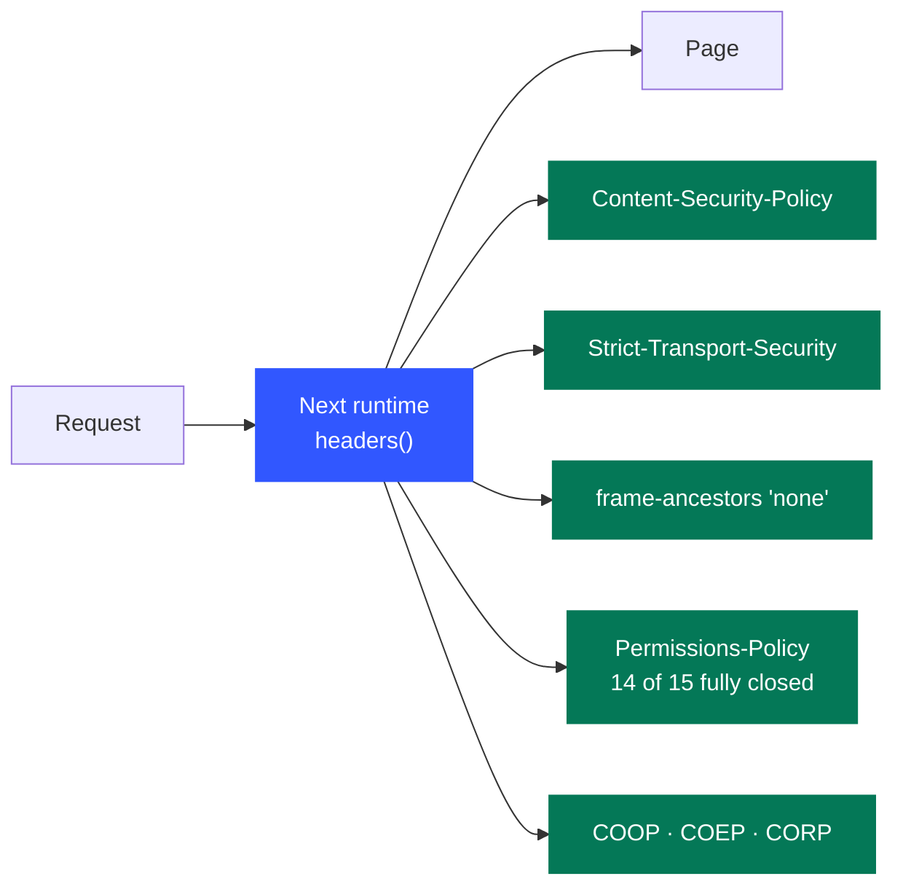
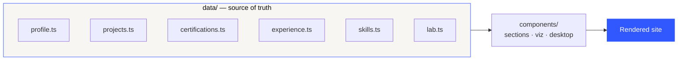

<div align="center">

# HET PATEL

### cybersecurity portfolio

An editorial, single-page portfolio built as a **digital instrument** rather than a template.

### **[→ hetpatel-lemon.vercel.app](https://hetpatel-lemon.vercel.app)**

<br>

[](https://github.com/het-P301204/HETPATEL-Portfolio/actions/workflows/ci.yml)
[](https://hetpatel-lemon.vercel.app)


<br>

**[Two ways in](#-two-ways-in)** · **[The rule](#-the-rule-this-site-is-built-on)** · **[Deployment](#-deployment)** · **[Design system](#-design-system-and-theme)** · **[Motion](#-motion)** · **[Accessibility](#-accessibility)**

</div>

---

```bash
npm install
npm run dev                 # http://localhost:3000
npm run build && npm start  # production
npm run typecheck           # tsc --noEmit
```

<br>

The scroll architecture is reference-informed: a staircase headline with one accent word and a
pinned work stage with an `01 / 05` counter (after Catalin Vintila), scroll-as-narrative over a
drifting field of technical debris (after Emilian Misera), a framed panel that opens to full bleed
and an inverted surface for one section (after Sly), and expandable, typographically-led information
rather than cards (after Yash Ahire). None of their content, branding or assets is used — only the
interaction language.

---

## 🚪 Two ways in

After the loading sequence resolves into the name, the site asks one question and the answer decides
which world runs. Both are the same person and the same data; only the interaction model differs.



| | STANDARD | DESKTOP |
| --- | --- | --- |
| **Answers** | Who is Het? | What does his world look like? |
| **Form** | The editorial document | An environment of objects and windows |
| **Inside** | Work, practice, experience, certifications, about | Files, archive, toolkit, terminal, and CASE / 001 |

<details>
<summary><b>How the two worlds coexist without a route change</b></summary>

<br>

`lib/mode.tsx` holds the only state that matters (`unset | standard | desktop`), persisted to
`localStorage` under `het-experience-mode` so a return visit can offer *continue* instead of asking
again. `CHANGE EXPERIENCE` — in the index overlay in standard mode, on the system bar in desktop
mode — always returns to the question.

No route change, no reload: the editorial world stays mounted and is parked
(`visibility: hidden`, `inert`) while the environment is on screen, so coming back lands exactly
where you left. The desktop is a dynamic import, so a visitor who chooses STANDARD never downloads
it.

</details>

<details>
<summary><b>CASE / 001 — a correlation exercise, not a quiz</b></summary>

<br>

Inside the desktop, **CASE / 001** is a third environment again: no wallpaper, no windows — evidence
and time. You select the log rows you think carry the account and then choose the account;
verification checks the evidence as well as the answer, so **the right conclusion drawn from the
wrong rows comes back as _unsupported_**.

Every line of it is synthetic and labelled as such, permanently, in the header.

</details>

---

## 📐 The rule this site is built on

> [!IMPORTANT]
> Everything on the page is supported by the résumé. No client, count, CVE, severity, percentage,
> award or year of experience is claimed anywhere, because none is documented.

Where something is a lab, a simulation or unfinished, the page says so in its own words —
`LAB ENVIRONMENT`, `CLOSED SIMULATION`, `IN PROGRESS`, `NOT STARTED`. Every project carries a
`limitations` field and every practice domain carries a `basis`. Please keep those fields populated
when you add work; **they are the reason the rest reads as credible.**

---

## 🔑 Identity values

Both live in [`data/profile.ts`](data/profile.ts):

| Field | Current | Why |
| --- | --- | --- |
| `siteUrl` | resolved at build time | Not hardcoded. Reads `NEXT_PUBLIC_SITE_URL`, else `VERCEL_PROJECT_PRODUCTION_URL` (injected by Vercel), else `localhost:3000`. A wrong origin here fails silently — it publishes a sitemap and link previews pointing at a host that does not resolve — so it is derived rather than typed. |
| `githubUrl` | [`het-P301204`](https://github.com/het-P301204) | Set. The contact row, footer link, desktop window and `sameAs` structured data are now live. Left empty, they stay visible but explicitly unavailable — nothing is hidden and nothing is invented. |

To point the site at a custom domain later, set `NEXT_PUBLIC_SITE_URL` in the Vercel project's
environment variables and redeploy. Nothing in the source needs to change.

Credential URLs follow the same rule and live in
[`data/certifications.ts`](data/certifications.ts). Every entry ships `credentialUrl: ""`. Fill one
in and that entry alone turns into a working `VIEW CREDENTIAL ↗` external link, the "N VERIFIABLE"
count in the section header updates, and the archive-wide note disappears once at least one is set.
No component changes are required. Nothing is ever derived from the provider name.

---

## 🚀 Deployment

Hosted on **Vercel**. The choice is not incidental:



[`next.config.mjs`](next.config.mjs) serves a full CSP plus HSTS, `frame-ancestors`, COOP/COEP and a
closed Permissions-Policy through Next's `headers()`, and it rewrites `/.well-known/security.txt`.

> [!WARNING]
> Static hosts that cannot set response headers — **GitHub Pages among them** — silently drop all of
> it. On a security portfolio that is a visible weakness rather than a cosmetic one.

```bash
npm i -g vercel
vercel login
vercel --prod
```

Vercel auto-detects Next.js; there is no `vercel.json` to maintain. After the first deploy, connect
the GitHub repository in the Vercel dashboard so `main` deploys on push and pull requests get
preview URLs.

<details>
<summary><b>Verify the headers actually landed</b></summary>

<br>

```bash
curl -sI https://hetpatel-lemon.vercel.app \
  | grep -iE "content-security|strict-transport|x-frame|permissions-policy"
```

[`.github/workflows/ci.yml`](.github/workflows/ci.yml) runs `npm ci`, `npm run typecheck` and
`npm run build` on every push and PR. It deliberately does **not** deploy — Vercel's own Git
integration does that, and a second deploying workflow would duplicate and race it.

</details>

<details>
<summary><b>Not in this repository — and why</b></summary>

<br>

Three files are ignored on purpose, verified by scanning rather than assumed:
`docs/Resume.pdf`, `docs/Cybersecurity-Portfolio-Project-Strategy.pdf` and `docs/SOURCE_OF_TRUTH.md`
all carry a phone number, and the résumé adds postal and location detail.

The site publishes none of that by design — see the note on location in
[`data/profile.ts`](data/profile.ts) — so committing them to a public repository would quietly undo
that decision. `awesome-design-md-main/` is third-party reference material and not this project's to
redistribute.

</details>

---

## ➕ Adding content — no component changes needed

> [!NOTE]
> `data/` is the source of truth. The UI only consumes it. Every table below is a data edit, never a
> component edit.



<details open>
<summary><b>The content map</b></summary>

<br>

| To add | Edit | Notes |
| --- | --- | --- |
| **A case** | `data/projects.ts` | `group` files it under one of the four strata (`professional`, `personal`, `lab`, `ctf`); the stratum and its counts are derived. `motif` picks the generated figure (`scan`, `vector`, `identity`, `token`, `timeline`, `control`, `trace`, `compete`). `confidential: true` adds the SEALED mark and the withheld-scope banner. |
| **A certification** | `data/certifications.ts` | `status: "IN PROGRESS"` marks the sheet hollow, tints its note and updates the header counts. `credentialUrl` decides the verification line. |
| **A role** | `data/experience.ts` | A role is a header plus `tracks`; each track is one collapsible area of work. A second role is a second object — no layout decisions to re-make. |
| **An academic year** | `data/education.ts` → `journey` | `state: "UNDATED"` renders the year as an open marker that says the source records nothing for it, rather than inventing a milestone. |
| **A capability** | `data/skills.ts` | `practice` for the domain lists, `stack` for the matrix. |
| **A lab write-up** | `data/lab.ts` → `entries` | The empty state disappears the moment the array has one object. |
| **A research direction** | `data/lab.ts` → `directions` | `SELECTED` = next build, `CONSIDERED` = catalogued. Neither implies work has started. |

Add a new diagram by adding a case to `components/viz/ProjectMotif.tsx` and a `motif` key in the
project type.

</details>

---

## 🗂 Structure

```
app/          layout, page, metadata, robots, sitemap, manifest, OG image
components/
  system/     Cursor, Nav, ProgressIndex, ThemeToggle, SmoothScroll
  primitives/ AnimatedText, MagneticElement, ScrollReveal, Rule, Section
  sections/   one file per section of the document
  viz/        ProjectMotif (generated case diagrams), TraceField (the signature)
data/         the source of truth — the UI only consumes this
lib/          hooks, stage (preloader → hero hand-off), useOverlay, helpers
styles/       hero.css, cases.css, sections.css (globals.css holds the tokens)
```

`lib/useOverlay.ts` owns the whole contract for anything that covers the page — scroll lock
(reference-counted per owner), Escape, focus trap, focus return and a cursor resync on close. Every
overlay uses it; none of them re-implements it.

---

## 🎨 Design system and theme

Tokens live in `app/globals.css`. Tailwind utilities point at runtime variables
(`--color-ink: var(--c-ink)`), so one attribute on `<html>` repaints the whole system — canvas
drawing included, since it reads the same properties through `readPalette()` in `lib/theme.tsx`.

| | Surface | Type | Accent |
| --- | --- | --- | --- |
| **Light** | `#f7f6f3` | `#0b0b0b` | cobalt `#3157ff` |
| **Dark** | `#0d0d0d` | `#f2f0ec` | amber `#ff6a1a` |

The two accents never appear together; each theme has one, plus a contrast-safe variant used on its
own inverted surface. The theme follows the system until the visitor chooses, then persists, and is
applied before first paint by the script in the document head.

<details>
<summary><b>Why the inverted section actually works — the one subtle thing here</b></summary>

<br>

`.on-ink` inverts a section by redeclaring the `--color-*` names — **not** the `--c-*` ones. A custom
property is substituted where it is *declared*, so overriding the inner layer would never reach a
`--color-*` already resolved at `:root`. That distinction is the whole reason the inverted section
works.

</details>

The accent is spent only where an interaction or a security state earns it: the initialising
percentage, the selected discipline, an unfinished certification, a refused permission in a diagram,
the flagged host in a scan. Both greys sit at the lightest value that still clears 4.5:1, because the
mono labels are 10–11px and there is no small-text exemption to lean on.

Type is **Archivo** (display and body, variable) and **IBM Plex Mono** (labels, metadata,
timestamps). `.t-colossal` through `.t-mono-sm` are the whole scale.

---

## 🎞 Motion

<details open>
<summary><b>The six choreographed moments</b></summary>

<br>

- **Loader → hero** — one component, because it is one moment. `00` steps to `100` in the exact
  position the name will occupy, the digits roll out as HET rolls in, PATEL arrives from the other
  side. Nothing is handed between elements, so there is no seam. Once per session
  (`sessionStorage`).
- **Hero outro** — the section is two screens tall with sticky contents: scrolling compresses the two
  words at different rates, separates the metadata and resolves the composition into SECURITY
  ENGINEERING.
- **Manifesto** — two stanzas assembled line by line in one sticky frame, over three parallax layers
  of technical debris.
- **Work** — six screens tall, stage sticky: the scroll advances the project, not the page. The
  figure opens from a framed panel to full bleed on entry; the title opens the record in place.
- **Practice** — the same idea applied to six domains: outline becomes solid as the scroll reaches
  each one.
- **Certifications** — an archive: rows scale up at the centre of the screen and compress as they
  leave. Scale only, never opacity, so nothing readable drops below the contrast floor.
- **The trace** (About) — a hairline follows the pointer, latches the five concerns it passes, and
  resolves them into the name. Without a pointer the same figure assembles from scroll position.

</details>

Every reveal is transform and opacity only. Breakpoint-dependent scroll choreography is built with
`gsap.matchMedia()`, so crossing 768px builds or tears the stage down rather than leaving a stale pin
behind. GSAP owns transforms exclusively — a from-state declared in CSS as well composes with the
tween and doubles the offset.

> [!NOTE]
> `prefers-reduced-motion` resolves everything to its finished state, and so does `<noscript>`.

---

## ♿ Accessibility

Axe-core (WCAG 2.1 A/AA + best practice) is clean across the selector, the desktop, an open window
and the case, except for two known false positives: the manifesto's background debris (pure
`aria-hidden` decoration, deliberately below reading weight, exempt under WCAG 1.4.3) and the custom
cursor's label, whose contrast axe cannot compute because it is produced by `mix-blend-mode: difference`
rather than by a colour pair.

<details>
<summary><b>What that means in the markup</b></summary>

<br>

Every desktop object is a real button with an accessible name ("Open certification archive — 9
entries · 1 pending"); the dock repeats the same set for anyone not using a pointer; window bodies
are focusable so they can be scrolled from the keyboard; and dragging is texture, never the way to
reach anything.

Semantic landmarks and heading order, a skip link, visible focus rings, and no content that exists
only inside a hover state: the hero index, the practice domains and the toolkit matrix all carry
their descriptions in the markup. Below 768px the pinned stages are replaced by a vertical index
rather than scaled down — the content is identical, the interaction is not.

</details>

---

<div align="center">
<sub>

Built by **Het Patel** · [LinkedIn](https://www.linkedin.com/in/het-patel-913017345) · [GitHub](https://github.com/het-P301204)

<sub>No analytics. No cookies. No third-party runtime requests. Every route prerendered.</sub>

</sub>
</div>
